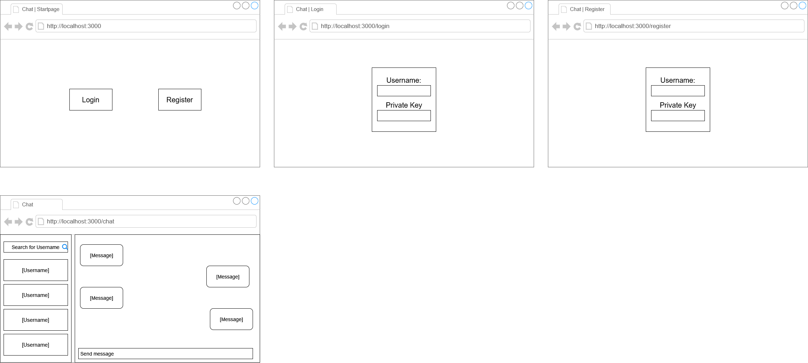

# Dokumentation - Private Chatting App

### Inhaltsverzeichnis

- [Dokumentation - Private Chatting App](#dokumentation---private-chatting-app)
    - [Inhaltsverzeichnis](#inhaltsverzeichnis)
  - [IPERKA](#iperka)
    - [Informieren](#informieren)
    - [Planen](#planen)
    - [Entscheiden](#entscheiden)
    - [Realisieren](#realisieren)
    - [Kontrollieren](#kontrollieren)
    - [Auswerten](#auswerten)
  - [Einleitung](#einleitung)
  - [Technologien](#technologien)
  - [Quellen](#quellen)
  - [Lokale Entwicklungsumgebung](#lokale-entwicklungsumgebung)
  - [Anforderungen](#anforderungen)
  - [Arbeitspakete](#arbeitspakete)
  - [Ausführung](#ausführung)
  - [Verschlüsselung der Benutzerdaten](#verschlüsselung-der-benutzerdaten)
  - [Login / Registration für Benutzer](#login--registration-für-benutzer)
  - [Anzeigen neuer Nachrichten](#anzeigen-neuer-nachrichten)
  - [Testen](#testen)
    - [Testfälle](#testfälle)
    - [Testprotokoll](#testprotokoll)
    - [Testbericht](#testbericht)
  - [Frontend](#frontend)
    - [Wireframe](#wireframe)
    - [Features](#features)
  - [Backend](#backend)
    - [Host](#host)
    - [API Enpoints](#api-enpoints)

## IPERKA

### Informieren

- [Technologien](#technologien)
- [Quellen](#quellen)
- [Lokale Entwicklungsumgebung](#lokale-entwicklungsumgebung)
- [Anforderungen](#anforderungen)

### Planen

- [Wireframe](#wireframe)
- [Testfälle](#testfälle)
- [Arbeitspakete](#arbeitspakete)

### Entscheiden

- [Verschlüsselung der Benutzerdaten](#verschlüsselung-der-benutzerdaten)
- [Login / Registration für Benutzer](#login--registration-für-benutzer)
- [Anzeigen neuer Nachrichten](#anzeigen-neuer-nachrichten)

### Realisieren

- [Ausführung](#ausführung)
- [Frontend](#frontend)
- [Backend](#backend)

### Kontrollieren

- [Testfälle](#testfälle)
- [Tesprotokoll](#testprotokoll)

### Auswerten

- [Testbericht](#testbericht)

## Einleitung

Die Seite ist unter den folgenden Adressen erreichbar:

- [https://chatapp1303.netlify.app](https://chatapp1303.netlify.app)
- [https://chat-47k.pages.dev](https://chat-47k.pages.dev)

Für dieses Projekt haben wir uns dafür entschieden, dass wir eine Chattingapplikation realisieren, bei der die Privatsphäre der Nutzer im Zentrum steht. Die Nachrichten dessen sollen deshalb mit einer "Ende zu Ende" (E2E) Verschlüsselungsmethode verschlüsselt werden.

## Technologien

Um unsere Chattingapplikation zu realisieren haben wir uns dazu entschieden die folgenden Technologien zu verwenden:

- [Node](https://nodejjs.org/en/about/)
- [Express](https://expressjs.com/de/)
- [React](https://reactjs.org)
- [TypeScript(tsx)](https://www.typescriptlang.org)

## Quellen

- [Deta Dokumenation](https://docs.deta.sh/docs/home/)
- [Express mit Typescript auf Deta](https://github.com/deta/docs/discussions/226)
- [Type Guards in TS](https://blog.logrocket.com/how-to-use-type-guards-typescript/)
- [Teilweise Logik und Codesnippets von usginfo.ch](https://github.com/mnaray/USG_Website)

## Lokale Entwicklungsumgebung

Auflistung der Tools und Plugins (inkl. Konfiguration)

## Anforderungen

| Anf.-Nr. | Muss/ Kann | funk./ qual. | Beschreibung                                                                                                                                                                                                       |
| :------- | :-------------- | ----------------- | ------------------------------------------------------------------------------------------------------------------------------------------------------------------------------------------------------------------ |
| 1        | M               | funk.             | Eine Landingpage mit einem Login- und Registrationsknopf ist vorhanden.                                                                                                                                            |
| 2        | M               | funk.             | Eine Registrationspage ist vorhanden.                                                                                                                                                                              |
| 3        | M               | funk.             | Eine Loginpage ist vorhanden.                                                                                                                                                                                      |
| 4        | M               | funk.             | Die Registrationspage hat ein Inputfeld für den Usernamen und ein Ausgabefeld (keine Eingabe möglich) mit den privaten Schlüssel, den man kopieren kann.                                                           |
| 5        | M               | funk.             | Die Loginpage hat zwei Inputfelder. Eines ist für den Username und das andere für den privaten Schlüssel.                                                                                                          |
| 6        | M               | funk.             | Die Registrationspage hat einen Knopf, der ein Schlüsselpaar generiert. Der private Schlüssel soll vom User als eine Art "Passwort" genutzt werden und der öffentliche soll in einer Datenbank gespeichert werden. |
| 7        | M               | funk.             | Die Loginpage hat einen Knopf, mit welchem man sich authentifizieren kann, um einen Bearer-Token zu erhalten.                                                                                                      |
| 8        | M               | qual.             | Nur wenn man einen Bearer-Token hat, soll man Chaträume öffnen können. (qual. da Clientsided und vom User im Browser umgehbar)                                                                                     |
| 9        | M               | funk.             | Die API-Endpoints sollen vor unautorisiertem Zugriff geschützt sein. (ausser Login- und Registrationsendpoints)                                                                                                    |
| 10       | K               | funk.             | Die API-Endpoints solle mit JWT geschützt sein.                                                                                                                                                                    |
| 11       | M               | funk.             | Die Chaträume sollen je Nachrichten von genau zwei Usern beinhalten können.                                                                                                                                        |
| 12       | M               | funk.             | User können Nachrichten in einen Chatraum senden.                                                                                                                                                                  |
| 13       | M               | funk.             | Alle Nachrichten in einem Chatraum werden nur in verschlüsselter Form auf der Datenbank gespeichert.                                                                                                               |
| 14       | M               | funk.             | User sollen Chaträume (er)öffnen können.                                                                                                                                                                           |
| 15       | M               | funk.             | User sollen Chaträume suchen können.                                                                                                                                                                               |
| 16       | M               | funk.             | Um die Verschlüsselung zu ermöglichen, werden die öffentlichen Schlüssel der User ausgetauscht. (von der Datenbank gefetcht)                                                                                       |
| 17       | M               | funk.             | Updates sollen über konstante HTTP-Requests geschehen. (da keine Websockets möglich)                                                                                                                               |
| 18       | K               | funk.             | Konstante updates über HTTP sollen optional sein, um Bandbreite zu sparen.                                                                                                                                         |
| 19       | M               | qual.             | Da eine hohe Privatsphäre gewährleistet werden soll, muss jederzeit die Option bestehen, Chaträume zu löschen.                                                                                                     |
| 20       | M               | funk.             | Beide Nutzer können zu jeder Zeit alle Nachrichten in ihrem gemeinsamen Chatraum lesen.                                                                                                                            |
| 21       | M               | funk.             | Nutzernamen dürfen nicht Redundant in der Datenbank vorhanden sein.                                                                                                                                                |

## Arbeitspakete

## Ausführung

## Verschlüsselung der Benutzerdaten

Für die Verschlüsselung der Nachrichten werden wir den öffentlichen Schlüssel des anderen Benutzers im Chatraum verwenden. Um später die Nachrichten des anderen wieder zu entschlüsseln, werden wir den privaten Schlüssel des Benutzers, der die Nachrichten anschauen möchte verwenden.

## Login / Registration für Benutzer

Nach langen Überlegungen haben wir uns dazu entschieden, dass wir für das Login der Benutzer einen Benutzernamen sowie einen privaten Schlüssel für die Authentifizierung verwenden wollen.

Jedoch haben wir uns dazu geeignet, dass ein Benutzer bei der Registrieung nur einen Benutzernamen angeben muss und dann automatisch ein Schlüsselpaar generiert wird. Damit er sich später wieder anmelden kann, soll ihm der private Schlüssel angezeigt werden. Es wird auch empfohlen, dass er den Schlüssel an einem sicheren Ort speichert.

Damit die Verschlüsselung der Nachrichten nicht obsolet wird, weil wir die (verschlüsselten) Nachrichten der Benutzer in einer Datenbank und den öffentlichen Schlüssel in einer nicht relationalen Datenbank speichern werden, haben wir uns dafür entschieden, nur einen Hashwert des privaten Schlüssels in der Datenbank zu speichern. Dies gibt den Schlüssel nicht preis, aber man kann ihn im gehashten Zustand immer noch für das einloggen verwenden.

## Anzeigen neuer Nachrichten

Wir haben uns bewusst dagegen entschieden einen [Websocket](https://de.wikipedia.org/wiki/WebSocket) für das Anzeigen der neuen Nachricht zu verwenden, da [Deta](https://deta.sh) (Cloudanbieter) die Erhaltung dessen nicht genug lange unterstützt. (maximal 10 Sekunden lange Prozesse)

Deshalb werden wir eine optionale und konstante Abfrage bei der API verwenden, um zu prüfen ob es neue Nachrichten gibt.

## Testen

### Testfälle

| Testf.-Nr. | Anf-Nr. | Vorbereitung                                                                                                                                                                                                                                                                   | Testumgebung                 | Eingabe                                                                                                          | Erw. Ausgabe                                                                                                                                                      |
| :--------: | ------- | :----------------------------------------------------------------------------------------------------------------------------------------------------------------------------------------------------------------------------------------------------------------------------- | ---------------------------- | ---------------------------------------------------------------------------------------------------------------- | ----------------------------------------------------------------------------------------------------------------------------------------------------------------- |
|    1.1     | 1       | Fertige Seite wurde deployed                                                                                                                                                                                                                                                   | Deployte Webseite im Browser | URL in den Browser eingeben.                                                                                     | Landingpage mit einem Titel und zwei Knöpfen (Login und Registration) soll erscheinen.                                                                            |
|    2.1     | 2       | Fertige Seite wurde deployed                                                                                                                                                                                                                                                   | Deployte Webseite im Browser | Auf den Registrationsknopf klicken.                                                                              | Man wird auf die Registrationspage weitergeleitet. In der URL soll nun "/login" am ende des Pfades stehen.                                                        |
|    3.1     | 3       | Fertige Seite wurde deployed                                                                                                                                                                                                                                                   | Deployte Webseite im Browser | Auf den Loginknopf klicken                                                                                       | Man wird auf die Loginpage weitergeleitet. In der URL soll nun "/register" am ende des Pfades stehen.                                                             |
|    4.1     | 4       | Fertige Seite wurde deployed und die Registrationsseite geöffnet                                                                                                                                                                                                               | Deployte Webseite im Browser | In das (obere) Inputfeld klicken und "FischersFritz" hinein schreiben.                                           | Das Geschriebene wird in diesem Feld angezeigt.                                                                                                                   |
|    4.2     | 4       | Fertige Seite wurde deployed und die Registrationsseite geöffnet                                                                                                                                                                                                               | Deployte Webseite im Browser | In das (untere) Ausgabefeld klicken und "1234" eingeben.                                                         | Das Feld ist nicht auswählbar. Es soll keine Eingabe darin erscheinen.                                                                                            |
|    4.3     | 4       | Fertige Seite wurde deployed und die Registrationsseite geöffnet. Ein Schlüssel wurde bereits generiert und in das Ausgabefeld eingefügt.                                                                                                                                      | Deployte Webseite im Browser | Auf den "Copy"-Knopf klicken.                                                                                    | Folgende Meldung erscheint: "Copied the private key to your clipboard! Make sure to store it somewhere secure."                                                   |
|    5.1     | 5       | Fertige Seite wurde deployed und die Loginseite geöffnet, zusätzlich muss der User "FischersFritz" schon erstellt sein                                                                                                                                                         | Deployte Webseite im Browser | In das obere Inputfeld klicken und "FischersFritz" eingeben.                                                     | Das Geschriebene wird in diesem Feld angezeigt.                                                                                                                   |
|    5.2     | 5       | Fertige Seite wurde deployed und die Loginseite geöffnet, zusätzlich muss der User "FischersFritz" schon erstellt sein                                                                                                                                                         | Deployte Webseite im Browser | In das untere Inputfeld klicken und den privaten Schlüssel, der bei der Registration ausgegeben wurde, eingeben. | Das Geschriebene wird in diesem Feld als kleine Pünktchen angezeigt.                                                                                              |
|    6.1     | 6       | Fertige Seite wurde deployed und die Registrationsseite geöffnet. Es soll "HansPeter" als Nutzername schon eingegeben sein. Es soll auch die API schon deployed sein.                                                                                                          | Deployte Webseite im Browser | Auf den "Generate Keypair"-Knopf klicken.                                                                        | Ein Schlüsselpaar wird generiert. Der private soll im Ausgabefeld angezeigt werden und der öffentliche mit dem erstellten Nutzer in der Datenbank vorhanden sein. |
|    7.1     | 7       | Fertige Seite wurde deployed und die Loginseite geöffnet, zusätzlich muss der User "FischresFritz" schon erstellt sein. Dessen privater Schlüssel soll schon im entsprechenden Feld eingegeben sein. Es soll auch die API schon deployed sein.                                 | Deployte Webseite im Browser | Auf den "Login"-Knopf klicken.                                                                                   | Man wird auf die "/chat"-Route weitergeleitet. Das signierte JWT ist nun im Sessionstorage gespeichert.                                                           |
|    7.2     | 7       | Fertige Seite wurde deployed und die Loginseite geöffnet, zusätzlich muss der User "FischresFritz" schon erstellt sein. Irgend ein Charaktersatz (über 50 Charakter) soll in das Feld für den privaten Schlüssel eingetragen werden. Es soll auch die API schon deployed sein. | Deployte Webseite im Browser | Auf den "Login"-Knopf klicken.                                                                                   | Folgende Meldung erscheint: "Wrong user credentials!"                                                                                                             |
|    8.1     | 8       | Fertige Seite wurde deployed. Der User soll nicht eingeloggt sein.                                                                                                                                                                                                             | Deployte Webseite im Browser | In der URL die Route auf "/chat" ändern.                                                                         | Man wird auf die Loginseite weitergeleitet.                                                                                                                       |
|    8.2     | 8       | Fertige Seite wurde deployed. Der User soll sich schon ein Mal in dieser Session eingeloggt haben.                                                                                                                                                                             | Deployte Webseite im Browser | In der URL die Route auf "/chat" ändern.                                                                         | Man wird auf die Chatseite weitergeleitet.                                                                                                                        |
|    9.1     | 9       | Die API wurde deployed.                                                                                                                                                                                                                                                        |                              |                                                                                                                  |                                                                                                                                                                   |
|            |         |                                                                                                                                                                                                                                                                                |                              |                                                                                                                  |                                                                                                                                                                   |
|            |         |                                                                                                                                                                                                                                                                                |                              |                                                                                                                  |                                                                                                                                                                   |
|            |         |                                                                                                                                                                                                                                                                                |                              |                                                                                                                  |                                                                                                                                                                   |
|            |         |                                                                                                                                                                                                                                                                                |                              |                                                                                                                  |                                                                                                                                                                   |
|            |         |                                                                                                                                                                                                                                                                                |                              |                                                                                                                  |                                                                                                                                                                   |
|            |         |                                                                                                                                                                                                                                                                                |                              |                                                                                                                  |                                                                                                                                                                   |
|            |         |                                                                                                                                                                                                                                                                                |                              |                                                                                                                  |                                                                                                                                                                   |
|            |         |                                                                                                                                                                                                                                                                                |                              |                                                                                                                  |                                                                                                                                                                   |
|            |         |                                                                                                                                                                                                                                                                                |                              |                                                                                                                  |                                                                                                                                                                   |

### Testprotokoll

### Testbericht

## Frontend

### Wireframe

### Features

## Backend

### Host

### API Enpoints
