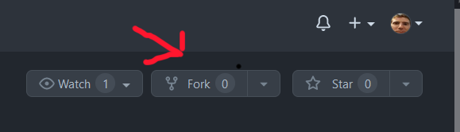
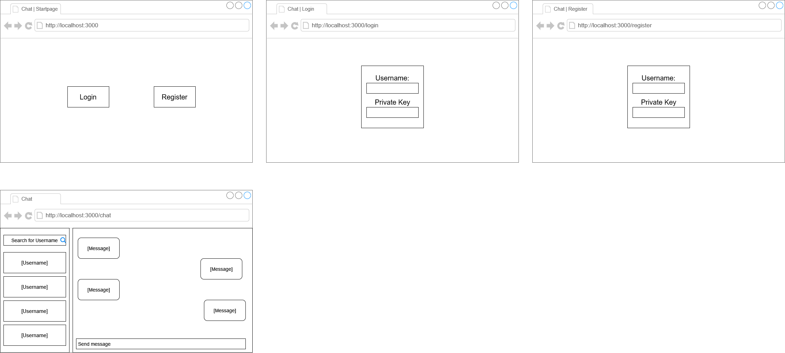

# Dokumentation - Private Chatting App

### Inhaltsverzeichnis

- [Dokumentation - Private Chatting App](#dokumentation---private-chatting-app)
  - [Inhaltsverzeichnis](#inhaltsverzeichnis)
  - [IPERKA](#iperka)
    - [Informieren](#informieren)
    - [Planen](#planen)
    - [Entscheiden](#entscheiden)
    - [Realisieren](#realisieren)
    - [Kontrollieren](#kontrollieren)
    - [Auswerten](#auswerten)
  - [Einleitung](#einleitung)
  - [Technologien](#technologien)
  - [Quellen](#quellen)
  - [Lokale Entwicklungsumgebung](#lokale-entwicklungsumgebung)
    - [Lokale Entwicklungsumgebung aufsetzen](#lokale-entwicklungsumgebung-aufsetzen)
    - [Vorbereitung](#vorbereitung)
    - [Dependencies mit NPM installieren](#dependencies-mit-npm-installieren)
    - [Lokale Server starten](#lokale-server-starten)
    - [Frontend starten](#frontend-starten)
    - [Optional: Backend starten](#optional-backend-starten)
  - [Anforderungen](#anforderungen)
  - [Arbeitspakete](#arbeitspakete)
  - [Ausführung](#ausführung)
  - [Verschlüsselung der Benutzerdaten](#verschlüsselung-der-benutzerdaten)
  - [Login / Registration für Benutzer](#login--registration-für-benutzer)
  - [Anzeigen neuer Nachrichten](#anzeigen-neuer-nachrichten)
  - [Testen](#testen)
    - [Testumgebung](#testumgebung)
      - [Selenium:](#selenium)
    - [Jest:](#jest)
    - [Postman:](#postman)
  - [Testfälle](#testfälle)
    - [Testprotokoll](#testprotokoll)
    - [Testbericht](#testbericht)
  - [Frontend](#frontend)
    - [Wireframe](#wireframe)
    - [Features](#features)
  - [Backend](#backend)
    - [Host](#host)
    - [Middleware](#middleware)
      - [checkAuth](#checkauth)
      - [checkUser](#checkuser)
    - [API Enpoints](#api-enpoints)
      - [/](#)
        - [/auth/register](#authregister)
        - [/auth/login](#authlogin)
        - [/chatroom/create](#chatroomcreate)

## IPERKA

### Informieren

- [Technologien](#technologien)
- [Quellen](#quellen)
- [Lokale Entwicklungsumgebung](#lokale-entwicklungsumgebung)
- [Anforderungen](#anforderungen)

### Planen

- [Wireframe](#wireframe)
- [Testfälle](#testfälle)
- [Arbeitspakete](#arbeitspakete)

### Entscheiden

- [Verschlüsselung der Benutzerdaten](#verschlüsselung-der-benutzerdaten)
- [Login / Registration für Benutzer](#login--registration-für-benutzer)
- [Anzeigen neuer Nachrichten](#anzeigen-neuer-nachrichten)

### Realisieren

- [Ausführung](#ausführung)
- [Frontend](#frontend)
- [Backend](#backend)

### Kontrollieren

- [Testfälle](#testfälle)
- [Tesprotokoll](#testprotokoll)

### Auswerten

- [Testbericht](#testbericht)

## Einleitung

Die Seite ist unter den folgenden Adressen erreichbar:

- [https://chatapp1303.netlify.app](https://chatapp1303.netlify.app)
- [https://chat-47k.pages.dev](https://chat-47k.pages.dev)

Für dieses Projekt haben wir uns dafür entschieden, dass wir eine Chattingapplikation realisieren, bei der die Privatsphäre der Nutzer im Zentrum steht. Die Nachrichten dessen sollen deshalb mit einer "Ende zu Ende" (E2E) Verschlüsselungsmethode verschlüsselt werden.

## Technologien

Um unsere Chattingapplikation zu realisieren haben wir uns dazu entschieden die folgenden Technologien zu verwenden:

- [Node](https://nodejjs.org/en/about/)
- [Express](https://expressjs.com/de/)
- [React](https://reactjs.org)
- [TypeScript(tsx)](https://www.typescriptlang.org)

## Quellen

- [Deta Dokumenation](https://docs.deta.sh/docs/home/)
- [Express mit Typescript auf Deta](https://github.com/deta/docs/discussions/226)
- [Type Guards in TS](https://blog.logrocket.com/how-to-use-type-guards-typescript/)
- [Teilweise Logik und Codesnippets von usginfo.ch (beispielsweise Teile der Middleware)](https://github.com/mnaray/USG_Website)
- [JSON-Objekte nach spezifischem Wert sortieren](https://dev.to/slimpython/sort-array-of-json-object-by-key-value-easily-with-javascript-3hke)
- [Unix-Timestamps zu einem "lesbaren" Datum konvertieren](https://stackoverflow.com/questions/30158574/how-to-convert-result-from-date-now-to-yyyy-mm-dd-hhmmss-ffff)

## Lokale Entwicklungsumgebung

Für die Umsetzung dieses Projekts haben wir hauptsächlich Visual Studio Code mit einigen Erweiterungen wie beispielsweise [ESLint](https://open-vsx.org/extension/dbaeumer/vscode-eslint), [Prettier](https://open-vsx.org/extension/esbenp/prettier-vscode), [REST Client](https://open-vsx.org/extension/humao/rest-client) und [Live Share](https://marketplace.visualstudio.com/items?itemName=MS-vsliveshare.vsliveshare) verwendet. Bei den beiden Erweiterungen REST Client und Live Share haben wir keine speziellen Einstellungen vorgenommen, wobei wir bei den Erweiterungen ESLint und Prettier spezielle Änderungen vorgenommen haben, um unseren eigenen Code-Style zu erzwingen. Diese Einstellungen werden automatisch übernommen, wenn man diese beiden Erweiterungen installiert und die lokale Entwicklungsumgebung richtig aufgesetzt hat.

### Lokale Entwicklungsumgebung aufsetzen

### Vorbereitung

Um die lokale Entwicklungsumgebung aufzusetzen, muss man sich zuerst eine Kopie vom Repository holen.

Dies kann man tun indem man dieses Repository einfach klont, jedoch kann man dann keine Änderungen zu GitHub pushen (hochladen), falls man kein eingetragener Contributor ist.

Deshalb sollte man das Repository forken und somit eine eigene Kopie davon erstellen, in der man dann seine Änderungen umsetzen kann.



Wenn das Repository erfolgreich geforkt wurde, muss man das Repository klonen und in das Verzeichnis wechseln.

```bash
git clone https://github.com/[durch deinen Benutzernamen ersetzen]/chat.git
cd chat/
```

### Dependencies mit NPM installieren

**_Für diesen Schritt ist es notwendig node.js installiert zu haben. [Download von node.js](https://nodejs.org/de/)_**

Sobald man das ganze Projekt geklont hat, sollte man alle Dependencies installieren. Dabei muss man in das entsprechende Verzeichnis wechseln und die Dependencies installieren.

**Dependencies im Frontend installieren**

```bash
cd client/
npm install
cd ..
```

Die Dependencies sollten jetzt installiert worden sein. Dabei gibt es eine Warnung, dass es sechs Sicherheitslücken gibt und man sie beheben sollte. Diese sind jedoch momentan zu vernachlässigen **[Stand: Januar 2023]**.

**Optional: Dependencies im Backend installieren**

**_Dieser Schritt ist optional, da das Projekt im Frontend ein externes Backend verwendet._**

```bash
cd server/
npm install
cd ..
```

### Lokale Server starten

### Frontend starten

Um das Frontend lokal zu starten, muss der folgende Befehl in dem Verzeichnis, wo das Frontend liegt (client/) ausgeführt werden, dann wird das Frontend auf **localhost:3000** gestartet.

```bash
npm run start
```

### Optional: Backend starten

**_Dieser Schritt ist optional, da das Projekt im Frontend ein externes Backend verwendet._**

**_Damit das Backend richtig funktioniert, muss man noch im server Ordner eine Datei mit dem Namen .env anlegen._**

**_In dieser Datei muss man zwei Umgebungsvariablen anlegen:_**

**\*PROJECT_KEY:** (Key von Deta.sh. [Mehr Informationen](https://docs.deta.sh/docs/faqs/))\*

**\*JWT_Secret:** Kann irgendeine Zeichenkette sein, jedoch sollte sie möglichst lang sein und aus zufällige Zeichen bestehen\*

Um das Backend lokal zu starten, muss der folgende Befehl in dem Verzeichnis, wo das Backend liegt (server/) ausgeführt werden, dann wird das Backend auf **localhost:3001** gestartet.

```
npm run dev
```

## Anforderungen

| Anf.-Nr. | Muss/<br />Kann | funk./<br />qual. | Beschreibung                                                                                                                                                                                                       |
| :------- | :-------------- | ----------------- | ------------------------------------------------------------------------------------------------------------------------------------------------------------------------------------------------------------------ |
| 1        | M               | funk.             | Eine Landingpage mit einem Login- und Registrationsknopf ist vorhanden.                                                                                                                                            |
| 2        | M               | funk.             | Eine Registrationspage ist vorhanden.                                                                                                                                                                              |
| 3        | M               | funk.             | Eine Loginpage ist vorhanden.                                                                                                                                                                                      |
| 4        | M               | funk.             | Die Registrationspage hat ein Inputfeld für den Usernamen und ein Ausgabefeld (keine Eingabe möglich) mit den privaten Schlüssel, den man kopieren kann.                                                           |
| 5        | M               | funk.             | Die Loginpage hat zwei Inputfelder. Eines ist für den Username und das andere für den privaten Schlüssel.                                                                                                          |
| 6        | M               | funk.             | Die Registrationspage hat einen Knopf, der ein Schlüsselpaar generiert. Der private Schlüssel soll vom User als eine Art "Passwort" genutzt werden und der öffentliche soll in einer Datenbank gespeichert werden. |
| 7        | M               | funk.             | Die Loginpage hat einen Knopf, mit welchem man sich authentifizieren kann, um einen Bearer-Token zu erhalten.                                                                                                      |
| 8        | M               | qual.             | Nur wenn man einen Bearer-Token hat, soll man Chaträume öffnen können. (qual. da Clientsided und vom User im Browser umgehbar)                                                                                     |
| 9        | M               | funk.             | Die API-Endpoints sollen vor unautorisiertem Zugriff geschützt sein. (ausser Login- und Registrationsendpoints)                                                                                                    |
| 10       | K               | funk.             | Die API-Endpoints sollen mit JWT geschützt sein.                                                                                                                                                                   |
| 11       | M               | funk.             | Die Chaträume sollen je Nachrichten von genau zwei Usern beinhalten können.                                                                                                                                        |
| 12       | M               | funk.             | User können Nachrichten in einen Chatraum senden.                                                                                                                                                                  |
| 13       | M               | funk.             | Alle Nachrichten in einem Chatraum werden nur in verschlüsselter Form auf der Datenbank gespeichert.                                                                                                               |
| 14       | M               | funk.             | User sollen Chaträume (er)öffnen können.                                                                                                                                                                           |
| 15       | M               | funk.             | User sollen Chaträume suchen können.                                                                                                                                                                               |
| 16       | M               | funk.             | Um die Verschlüsselung zu ermöglichen, werden die öffentlichen Schlüssel der User ausgetauscht. (von der Datenbank gefetcht)                                                                                       |
| 17       | M               | funk.             | Updates sollen über konstante HTTP-Requests geschehen. (da keine Websockets möglich)                                                                                                                               |
| 18       | K               | funk.             | Konstante updates über HTTP sollen optional sein, um Bandbreite zu sparen.                                                                                                                                         |
| 19       | M               | qual.             | Da eine hohe Privatsphäre gewährleistet werden soll, muss jederzeit die Option bestehen, Chaträume zu löschen.                                                                                                     |
| 20       | M               | funk.             | Beide Nutzer können zu jeder Zeit alle Nachrichten in ihrem gemeinsamen Chatraum lesen.                                                                                                                            |
| 21       | M               | funk.             | Nutzernamen dürfen nicht Redundant in der Datenbank vorhanden sein.                                                                                                                                                |

## Arbeitspakete

> 1x Arbeitspaket = 45 Minuten (eine Schullektion)
> 1x Sitzung = 5x Arbeitspakete (ein Halbtag)
>
> 5x Sitzungen _ 5x Arbeitspakete _ 2x Gruppenmitglieder = **50 Arbeitspakete + Portfolioeintrag 8 (4 / Gruppenmitglied)**

| Nr. | Frist    | Beschreibung                                                              | Zeit in Arbeitspaketen (geplant) |
| --- | -------- | ------------------------------------------------------------------------- | :------------------------------- |
| 1   | 16.12.22 | Informieren (von IPERKA)                                                  | 10                               |
| 2   | 23.12.22 | Planen und Entscheiden (von IPERKA)                                       | 4                                |
| 3   | 23.12.22 | Realisieren (von IPERKA) der Anforderungen Nr. 1 bis 6                    | 6                                |
| 4   | 13.01.23 | Realisieren (von IPERKA) der Anforderungen Nr. 7 bis 15, aber ohne Nr. 13 | 10                               |
| 5   | 20.01.23 | Realisieren (von IPERKA) der Anforderungen Nr. 13 und Nr. 16 bis 21       | 10                               |
| 6   | 27.01.23 | Kontrollieren und Auswerten (von IPERKA)                                  | 10                               |
| 7   | 03.02.23 | Portfolioeintrag fertigstellen                                            | 8                                |

## Ausführung

## Verschlüsselung der Benutzerdaten

Für die Verschlüsselung der Nachrichten werden wir den öffentlichen Schlüssel des anderen Benutzers im Chatraum verwenden. Um später die Nachrichten des anderen wieder zu entschlüsseln, werden wir den privaten Schlüssel des Benutzers, der die Nachrichten anschauen möchte verwenden.

## Login / Registration für Benutzer

Nach langen Überlegungen haben wir uns dazu entschieden, dass wir für das Login der Benutzer einen Benutzernamen sowie einen privaten Schlüssel für die Authentifizierung verwenden wollen.

Jedoch haben wir uns dazu geeignet, dass ein Benutzer bei der Registrieung nur einen Benutzernamen angeben muss und dann automatisch ein Schlüsselpaar generiert wird. Damit er sich später wieder anmelden kann, soll ihm der private Schlüssel angezeigt werden. Es wird auch empfohlen, dass er den Schlüssel an einem sicheren Ort speichert.

Damit die Verschlüsselung der Nachrichten nicht obsolet wird, weil wir die (verschlüsselten) Nachrichten der Benutzer in einer Datenbank und den öffentlichen Schlüssel in einer nicht relationalen Datenbank speichern werden, haben wir uns dafür entschieden, nur einen Hashwert des privaten Schlüssels in der Datenbank zu speichern. Dies gibt den Schlüssel nicht preis, aber man kann ihn im gehashten Zustand immer noch für das einloggen verwenden.

## Anzeigen neuer Nachrichten

Wir haben uns bewusst dagegen entschieden einen [Websocket](https://de.wikipedia.org/wiki/WebSocket) für das Anzeigen der neuen Nachricht zu verwenden, da [Deta](https://deta.sh) (Cloudanbieter) die Erhaltung dessen nicht genug lange unterstützt. (maximal 10 Sekunden lange Prozesse)

Deshalb werden wir eine optionale und konstante Abfrage bei der API verwenden, um zu prüfen ob es neue Nachrichten gibt.

## Testen

### Testumgebung

Grundsätzlich verwenden für die verschiedenen Testfälle drei unterschiedliche Testumgebungen:

#### Selenium:

**Betriebssystem:**

Den Browser, in dem wir die Tests mit der Selenium-IDe ausführen, wird auf der neusten Microsoft Windows 10 Version (22H2) ausgeführt.

**Browser:**

Für den Browser verwenden wir die neuste Version von Mozilla Firefox (109.00).

**Selenium-IDE:**

Für die automatischen Tests mit Selenium verwenden wir die neuste Version der Selenium-IDE für Mozilla Firefox (3.17.4).

### Jest:

**Betriebssystem:**

Node.js wird auf der neusten Microsoft Windows 10 Version (22H2) ausgeführt.

**Node.js:**

Die Node.js-Runtime verwendet Long-term-support-Version(18.13.0).

**Jest-Package:**

Das Jest-Package verwendet die Long-term-support-Version (5.16.5).

### Postman:

**Betriebssystem:**

Die Postman-Applikation, in der wir die automatischen Tests der API-Endpoints ausführen, wird auf der neusten Microsoft Windows 10 Version (22H2) ausgeführt.

**Postman:**

Die Postman-Applikation verwendet die neuste Version (10.8.4)

## Testfälle

| Testf.-Nr. | Anf-Nr. | Vorbereitung                                                                                                                                                                                                                                                                   | Testumgebung | Eingabe                                                                                                          | Erw. Ausgabe                                                                                                                                                      |
| :--------: | ------- | :----------------------------------------------------------------------------------------------------------------------------------------------------------------------------------------------------------------------------------------------------------------------------- | ------------ | ---------------------------------------------------------------------------------------------------------------- | ----------------------------------------------------------------------------------------------------------------------------------------------------------------- |
|    1.1     | 1       | Fertige Seite wurde deployed                                                                                                                                                                                                                                                   | Selenium     | URL in den Browser eingeben.                                                                                     | Landingpage mit einem Titel und zwei Knöpfen (Login und Registration) soll erscheinen.                                                                            |
|    2.1     | 2       | Fertige Seite wurde deployed                                                                                                                                                                                                                                                   | Selenium     | Auf den Registrationsknopf klicken.                                                                              | Man wird auf die Registrationspage weitergeleitet. In der URL soll nun "/login" am ende des Pfades stehen.                                                        |
|    3.1     | 3       | Fertige Seite wurde deployed                                                                                                                                                                                                                                                   | Selenium     | Auf den Loginknopf klicken                                                                                       | Man wird auf die Loginpage weitergeleitet. In der URL soll nun "/register" am ende des Pfades stehen.                                                             |
|    4.1     | 4       | Fertige Seite wurde deployed und die Registrationsseite geöffnet                                                                                                                                                                                                               | Selenium     | In das (obere) Inputfeld klicken und "FischersFritz" hinein schreiben.                                           | Das Geschriebene wird in diesem Feld angezeigt.                                                                                                                   |
|    4.2     | 4       | Fertige Seite wurde deployed und die Registrationsseite geöffnet                                                                                                                                                                                                               | Selenium     | In das (untere) Ausgabefeld klicken und "1234" eingeben.                                                         | Das Feld ist nicht auswählbar. Es soll keine Eingabe darin erscheinen.                                                                                            |
|    4.3     | 4       | Fertige Seite wurde deployed und die Registrationsseite geöffnet. Ein Schlüssel wurde bereits generiert und in das Ausgabefeld eingefügt.                                                                                                                                      | Selenium     | Auf den "Copy"-Knopf klicken.                                                                                    | Folgende Meldung erscheint: "Copied the private key to your clipboard! Make sure to store it somewhere secure."                                                   |
|    5.1     | 5       | Fertige Seite wurde deployed und die Loginseite geöffnet, zusätzlich muss der User "FischersFritz" schon erstellt sein                                                                                                                                                         | Selenium     | In das obere Inputfeld klicken und "FischersFritz" eingeben.                                                     | Das Geschriebene wird in diesem Feld angezeigt.                                                                                                                   |
|    5.2     | 5       | Fertige Seite wurde deployed und die Loginseite geöffnet, zusätzlich muss der User "FischersFritz" schon erstellt sein                                                                                                                                                         | Selenium     | In das untere Inputfeld klicken und den privaten Schlüssel, der bei der Registration ausgegeben wurde, eingeben. | Das Geschriebene wird in diesem Feld als kleine Pünktchen angezeigt.                                                                                              |
|    6.1     | 6       | Fertige Seite wurde deployed und die Registrationsseite geöffnet. Es soll "HansPeter" als Nutzername schon eingegeben sein. Es soll auch die API schon deployed sein.                                                                                                          | Selenium     | Auf den "Generate Keypair"-Knopf klicken.                                                                        | Ein Schlüsselpaar wird generiert. Der private soll im Ausgabefeld angezeigt werden und der öffentliche mit dem erstellten Nutzer in der Datenbank vorhanden sein. |
|    7.1     | 7       | Fertige Seite wurde deployed und die Loginseite geöffnet, zusätzlich muss der User "FischresFritz" schon erstellt sein. Dessen privater Schlüssel soll schon im entsprechenden Feld eingegeben sein. Es soll auch die API schon deployed sein.                                 | Selenium     | Auf den "Login"-Knopf klicken.                                                                                   | Man wird auf die "/chat"-Route weitergeleitet. Das signierte JWT ist nun im Sessionstorage gespeichert.                                                           |
|    7.2     | 7       | Fertige Seite wurde deployed und die Loginseite geöffnet, zusätzlich muss der User "FischresFritz" schon erstellt sein. Irgend ein Charaktersatz (über 50 Charakter) soll in das Feld für den privaten Schlüssel eingetragen werden. Es soll auch die API schon deployed sein. | Selenium     | Auf den "Login"-Knopf klicken.                                                                                   | Folgende Meldung erscheint: "Wrong user credentials!"                                                                                                             |
|    8.1     | 8       | Fertige Seite wurde deployed. Der User soll nicht eingeloggt sein.                                                                                                                                                                                                             | Jest         | In der URL die Route auf "/chat" ändern.                                                                         | Man wird auf die Loginseite weitergeleitet.                                                                                                                       |
|    8.2     | 8       | Fertige Seite wurde deployed. Der User soll sich schon ein Mal in dieser Session eingeloggt haben.                                                                                                                                                                             | Jest         | In der URL die Route auf "/chat" ändern.                                                                         | Man wird auf die Chatseite weitergeleitet.                                                                                                                        |
|    9.1     | 9       | Die API wurde deployed.                                                                                                                                                                                                                                                        | Postman      | GET /users/getall ohne Token                                                                                     | Response soll folgende Nachricht beinhalten: "jwt must be provided"                                                                                               |
|    9.2     | 9       | Die API wurde deployed.                                                                                                                                                                                                                                                        | Postman      | GET /users/getall mit gültigem Token                                                                             | Response soll eine Array an allen Nutzernamen beinhalten.                                                                                                         |
|    9.3     | 9       | Die API wurde deployed.                                                                                                                                                                                                                                                        | Postman      | GET /users/getall mit abgelaufenem Token                                                                         | Response soll folgende Nachricht beinhalten: "jwt expired"                                                                                                        |
|    9.4     | 9       | Die API wurde deployed.                                                                                                                                                                                                                                                        | Postman      | GET /users/getall mit fehlerhaftem Token                                                                         | Response soll folgende Nachricht beinhalten: "invalid token"                                                                                                      |
|    10.1    | 10      | Die API wurde deployed.                                                                                                                                                                                                                                                        | Postman      | POST /users/getall mit gültigen Logindaten                                                                       | Response soll einen JSON-Web-Token beinhalten. ([hier](https://jwt.io/)verifizierbar)                                                                             |
|    11.1    | 11      | Die API wurde deployed.                                                                                                                                                                                                                                                        | Postman      |                                                                                                                  |                                                                                                                                                                   |
|    12.1    | 12      | Die API und die fertige Webseite wurden beide deployed. Ein Chatraum wurde geöffnet.                                                                                                                                                                                           | Selenium     | "Hallo Welt!" in die Textbox eingeben und absenden.                                                              | Die Textbox leert sich, die Eingabe erscheint als Nachricht vom Absender und dem Empfänger wird die Nachricht angezeigt.                                          |
|    13.1    | 13      | Die API wurde deployed.                                                                                                                                                                                                                                                        | Postman      |                                                                                                                  |                                                                                                                                                                   |
|    14.1    | 14      | Die API und die fertige Webseite wurden beide deployed. Es darf noch kein Chat mit "FischersFritz" vorhanden sein.                                                                                                                                                             | Selenium     | Auf den "OPEN"-Knopf neben "FischersFritz" klicken.                                                              | Im Fenster danaben öffnet sich ein neuer Chat. Er beinhaltet noch keine Nachrichten.                                                                              |
|    14.2    | 14      | Die API und die fertige Webseite wurden beide deployed. Es muss ein Chat mit "FischersFritz" vorhanden sein.                                                                                                                                                                   | Selenium     | Auf den "OPEN"-Knopf neben "FischersFritz" klicken.                                                              | Im Fenster danaben öffnet sich ein neuer Chat. Er beinhaltet die bisherigen, entschlüsselten Nachrichten.                                                         |
|    15.1    | 15      | Die API und die fertige Webseite wurden beide deployed. Das Suchfeld soll leer sein.                                                                                                                                                                                           | Selenium     | "FischersFritz" in das ausgewählte Suchfeld eingeben.                                                            | Die Eingabe erscheint im Suchfeld und die Usernamen unter dem Suchfeld beschränken sich nur auf Namen, welche die Eingabe beinhalten.                             |
|    15.2    | 15      | Die API und die fertige Webseite wurden beide deployed. Das Suchfeld soll "FischersFritz" beinhalten.                                                                                                                                                                          | Selenium     | Den Text aus dem Suchfeld entfernen.                                                                             | Alle Usernamen aus der Datenbank werden angezeigt.                                                                                                                |
|    16.1    | 16      |                                                                                                                                                                                                                                                                                |              |                                                                                                                  |                                                                                                                                                                   |
|    17.1    | 17      | Die API und die fertige Webseite wurden beide deployed. Beide Teilnehmer eines Chatraums haben den Chat offen.                                                                                                                                                                 | Selenium     | Einer schickt "Guten Tag." in den Chat.                                                                          | Der andere soll diese Nachricht innerhalb weniger Sekunden bekommen.                                                                                              |
|    18.1    | 18      | Die API und die fertige Webseite wurden beide deployed. Beide Teilnehmer eines Chatraums haben den Chat offen.                                                                                                                                                                 | Selenium     | Konstante HTTP-Requests ausschalten. Einer schickt "Guten Tag." in den Chat.                                     | Neue Nachrichten werden nicht mehr automatisch angezeigt.                                                                                                         |
|    18.2    | 18      | Die API und die fertige Webseite wurden beide deployed. Beide Teilnehmer eines Chatraums haben den Chat offen.                                                                                                                                                                 | Selenium     | Nach Testfall 18.1 den Refresh-Knopf klicken.                                                                    | Neue Nachrichten werden nun im Chat angezeigt, aber konstante Abfragen blauben ausgestellt.                                                                       |
|    19.1    | 19      | Die API und die fertige Webseite wurden beide deployed. Mindestens einer der beiden Teilnehmer eines Chatraums hat diesen offen.                                                                                                                                               | Selenium     | Auf den "DELETE"-Knopf klicken.                                                                                  | Der ganze Chatraum wird gelöscht und der Datensatz wird aus der Datenbank gedropped. Der Chat verschwindet vom Bildschirm.                                        |
|    20.1    | 20      | Die API und die fertige Webseite wurden beide deployed.                                                                                                                                                                                                                        | Selenium     | Einen vorhandenen Chatraum öffnen.                                                                               | Alle Nachrichten werden korrekt entschlüsselt und laden im Chat.                                                                                                  |
|    21.1    | 20      | Die API wurde deployed. User ist schon in der Datenbank vorhanden.                                                                                                                                                                                                             | Postman      | POST /auth/register mit Username, privatem und öffentlichem Schlüsel                                             | Folgender Error soll zurückgegeben werden: "Username already taken!"                                                                                              |

### Testprotokoll

### Testbericht

## Frontend

### Wireframe



Damit wir keine Konflikte in Sachen Struktur im Frontend haben, erstellten wir ein Wireframe. Dieses zeigt grob auf, wie die wichtigsten Seiten der Applikation im Frontend aussehen. Es dient als Orientierungshilfe beim Implementieren der Komponenten. Das Design halten wir grunsätzlich über die ganze Applikation hinweg eher simpel und minimalistisch.

### Features

## Backend

### Host

Wir hosten unsere API bei dem Cloudanbieter Deta, der es Entwicklern ermögtlich, kleine Microservices und No-SQL kostenlos für ihr Projekt zu verwenden.

### Middleware

#### [checkAuth](../server/src/middleware/checkAuth.ts)

Mit dieser Middleware verifizieren wir den JWT, indem wir ihn entschlüsseln und die Claims überprüfen. Die Claims beinhalten nämlich einen Usernamen, den wir in der Datenbank suchen. Wenn die Datenbank die Existenz dieses Nutzer bestätigen kann, akzeptieren wir den Token und fahren mit der bearbeitung der Request fort.

Falls der Username nicht in unserer Datenbank existiert, wird ein Statuscode von `401 Unauthorized` zurückgegeben. Es wird in einer Nachricht auch mitgeteilt, dass der Nutzer nicht gefunden wurde. Die Bearbeitung der Request wird sofort abgebrochen.

#### [checkUser](../server/src/middleware/checkUser.ts)

Mit dieser Funktion wird überprüft, ob der Username, welcher in den Claims des JWT gespeichert ist, einem der zwei Teilnehmer eines Chatrooms gehört. Wenn dieser Chatroom nicht existiert, wird ein Statuscode `204 No Content` zurückgegeben. Vom Frontend aus wird dann der [/chatroom/create Enpoint](#chatroomcreate) verwendet, um einen Chatroom zu erstellen.

Falls der Chatroom existiert, aber den Usernamen aus dem JWT nicht im Teilnehmer-Array beinhaltet, wird die Request abgebrochen. In einer Nachricht mitgeteilt, dass der Username im Token und im gefragten Datensatz nicht übereinstimmen.

### API Enpoints

#### [/](../server/src/index.ts)

##### [/auth/register](../server/src/routes/auth.ts)

`POST` nimmt einen Request-Body in folgendem Format an:

```json
{
    username: string,
    publicKey: string,
    privateKey: string
}
```

Zuerst wird überprüft, ob der Benutzer bereits existiert. Wenn dies der Fall ist, wird der Statuscode 409 und eine Fehlermeldung "Username already taken!" zurückgegeben und der Prozess wird abgebrochen.

Wenn jedoch ein gültiger Benutzername eingegeben wird, wird der privateKey mit [argon2](https://de.wikipedia.org/wiki/Argon2) gehasht. Danach wird alles in der Tabelle "users" in einer Deta (No-SQL) Datenbank gespeichert.

Falls während diesem Prozess ein Fehler auftritt, wird der Statuscode 503 und eine Fehlermeldung "Error with the database" zurückgegeben.

##### [/auth/login](../server/src/routes/auth.ts)

`POST` nimmt einen Request-Body in folgendem Format an:

```json
{
    username: string,
    privateKey: string
}
```

Zuerst wird überprüft, ob der Benutzer überhaupt existiert. Wenn dies nicht der Fall ist, wird der Statuscode 409 und eine Fehlermeldung "There is no sucher user!" zurückgegeben und der Prozess wird abgebrochen.

Wenn jedoch ein gültiger Benutzername eingegeben wird, wird der eingegebene privateKey mit dem Hash in der Datenbank verglichen. Falls der privateKey mit dem Hash in der Datenbank übereinstimmt, wird ein JWT-Token für den Benutzer mit seinem Benutzernamen erstellt. Dieses ist dann für eine Stunde gültig. Wenn der privateKey jedoch nicht dem Hash in der Datenbank übereinstimmt, wird der Statuscode 409 und eine Fehlermeldung "Wrong Credentials!" und "success: false" zurückgegeben.

Falls während diesem Prozess ein Fehler auftritt, wird der Statuscode 503 und eine Fehlermeldung mit der entsprechenden Fehlermeldung zurückgegeben. Falls der Fehler jedoch nicht zugeordnet werden konnte, wird der Statuscode 503 und einer Fehlermeldung "Unknown Error" zurückgegeben.

##### [/chatroom/create](../server/src/routes/chatroom.ts)

`POST` nimmt einen Request-Body in folgendem Format an:

**_Für die Erstellung eines Chatrooms ist "messages" optional!_**

```json
{
    participants: [
        {
        username: string,
        publicKey: string
        },
        {
        username: string,
        publicKey: string
        }
    ],
    messages: [
        {
          "msg": string,
          "author": string,
          "dateTime": number
        }
    ]
}
```

Zuerst werden die beiden Teilnehmer des Chatrooms alphabetisch sortiert, damit der Key der beiden Benutzer einzigartig ist, und in einem Array gespeichert

Danach wird für jeden Teilnehmer durch diesen Array iteriert. Bei jeder Iteration wird aus der Benutzername des Teilnehmers zu der Key Variabel hinzugefügt. Ausserdem wird überprüft, ob der Benutzer überhaupt existiert.

Wenn der Benutzer nicht existiert, wird der Statuscode 409 und eine Fehlermeldung "Failed to create the chatroom. There is no such user!" zurückgegeben und der Prozess wird abgebrochen.

Danach wird aus dem Key, den Teilnehmern des Chatrooms und deren Nachrichten ein JSON-Objekt erstellt.

Falls während diesem Prozess kein Fehler auftritt, wird der Statuscode 201, die Teilnehmer des Chatrooms, ihre Nachrichten und success: true zurückgegeben.

Wenn jedoch ein Fehler auftritt, wird der Statuscode 500, die entsprechende Fehlermeldung und sucess: false zurückgegeben.

[/chatroom/delete](../server/src/routes/chatroom.ts)

`POST` nimmt einen Request-Body in folgendem Format an:

```json
{
  key: string
}
```

Zuerst wird überprüft, ob unter dem Key von dem Request-Body überhaupt Daten in der Datenbank gespeichert sind. Falls nicht, wird der Statuscode 404 und eine Fehlermeldung "Failed to delete chatroom. This chatroom does not exist!" zurückgegeben.

Ansonsten wird der Chatroom gelöscht und es wird der Statuscode 200, eine Nachricht "Deleted chatroom" und success: true zurückgegeben.

Falls während diesem Prozess jedoch ein Fehler auftritt, wird der Statuscode 500 und die entsprechende Fehlermeldung zurückgegeben.

[/chatroom/send](../server/src/routes/chatroom.ts)

`POST` nimmt einen Request-Body in folgendem Format an:

```json
{
    key: string,
    message:
     {
        author: string,
        dateTime: number,
        msg: string
    }
}
```

Zuerst wird überprüft, ob unter dem Key von dem Request-Body überhaupt Daten in der Datenbank gespeichert sind. Falls nicht, wird der Statuscode 404 und eine Fehlermeldung "Failed to send message! This chatroom does not exist!" und success: false zurückgegeben und der Prozess wird abgebrochen.

Ansonsten werden die aktuellen Nachrichten als Array von der Datenbank geholt und die neue Nachricht wird diesem Array angefügt.

Danach wird mit diesem Array die Datenbank mit der Update-Methode von Deta auf den neusten Stand gebracht und es wird der Statuscode 201, eine Nachricht "Sent message!" und success: true zurückgegeben.

Falls während diesem Prozess jedoch ein Fehler auftritt, wird der Statuscode 500 und die entsprechende Fehlermeldung und falls der Fehler nicht zugeordnet werden kann "Unknown Error occured!" und success: false zurückgegeben.

[/chatroom/getMessages](../server/src/routes/chatroom.ts)

`POST` nimmt einen Request-Body in folgendem Format an:

```json
{
    key: string
}
```

Zuerst wird überprüft, ob unter dem Key von dem Request-Body überhaupt Daten in der Datenbank gespeichert sind. Falls nicht, wird der Statuscode 204 zurückgegeben und der Prozess wird abgebrochen.

Ansonsten werden die Nachrichten von der Datenbank geholt und mit dem Statuscode 201 und success: true zurückgegeben.

Falls während diesem Prozess jedoch ein Fehler auftritt, wird der Statuscode 500 und die entsprechende Fehlermeldung und falls der Fehler nicht zugeordnet werden kann "Unknown Error occured!" und success: false zurückgegeben.

[/keys/getPublic/:username](../server/src/routes/keys.ts)

`GET` nimmt einen Benutzernamen als String in der Request-URL an.

Zuerst wird überprüft, ob der Benutzer überhaupt in der Datenbank existiert. Falls dies nicht der Fall ist, wird der Statuscode 409 und eine Fehlermeldung "There is no such user!" zurückgegeben und der Prozess wird abgebrochen.

Ansonsten wird der publicKey vom Benutzer aus der Datenbank geholt. Dieser und der Statuscode 201 wird dann zurückgegeben.

Falls während diesem Prozess jedoch ein Fehler auftritt, wird der Statuscode 409 und die entsprechende Fehlermeldung und falls der Fehler nicht zugeordnet werden kann "Unknown Error occured!" und success: false zurückgegeben.

[/keys/generateKeypair](../server/src/routes/keys.ts)

`GET` nimmt keine Daten an.

Zuerst wird mit der generateKeypair Methode von dem Crypto NPM-Package ein rsa Schlüsselpair mit einer Schlüssellänge von 4096 Bit, einer PEM-Formatierung und dem Type pkcs1 generiert.

Falls während diesem Prozess ein Fehler auftritt, wird der Statuscode 500 und die entsprechende Fehlermeldung zurückgegeben.

Ansonsten wird der public- sowie privateKey zu einer Linie konveriert und dann zurückgegeben.

[/users/getall](../server/src/routes/users.ts)

`GET` nimmt keine Daten an.

Fetcht den gesamten Datensatz der Users-Tabelle mit der Fetch-Methode von Deta. Danach wird bei jedem Benutzer nur der Benutzername in einem Array gespeichert.

Falls kein Fehler auftritt während diesem Prozess, wird dieser Array als JSON-Objekt zurückgegeben.

Ansonsten wird der Statuscode 503 und die enstprechende Fehlermeldung zurückgegeben.
